# Capstone Project - Blood cell detection for Cancer prediction

## Problem description
This project provides the ability to build and deploy Cancer prediction application related on Blood cell detection.

Cancer (leukemia) prediction is based on classification of blood cells into three risk categories:

High-risk indicators: Myeloblasts (AML indicators) - 12-20 micrometers, round/oval shape, high nuclear-cytoplasm ratio, visible nucleoli

Middle-risk indicators: Segmented Neutrophils - morphological changes can indicate leukemic conditions

Low-risk/normal cells: Basophils, Erythroblasts, Monocytes - their presence in normal ranges indicates lower risk

In case of detection of the each class application can provide blood cancer predictions with related level of risk.

Like an examples:
- If appliacation predicted that the image is Myeloblasts cell we have to alarm about high risk of blood cancer (leukemia).
- If appliacation predicted that the image is Segmented Neutrophils cell we have to warn about middle risk of blood cancer (leukemia).
- If appliacation predicted that the image is Basophils/Erythroblasts/Monocytes cell we have to inform about low risk of blood cancer (leukemia).

Final result of working application can be viewed here:

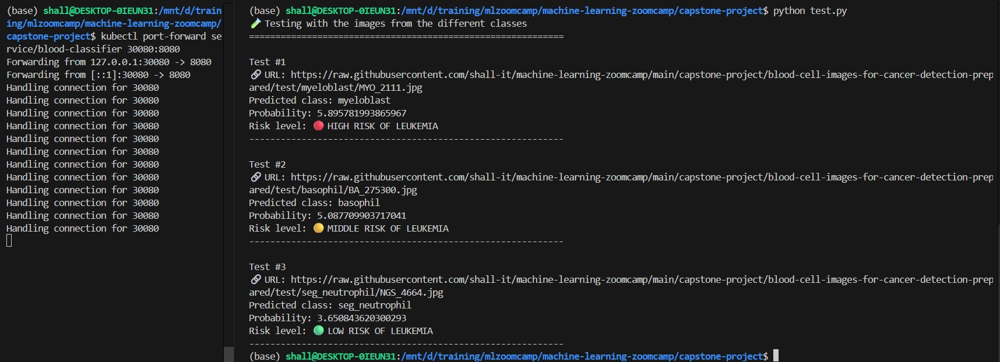


### Dataset details

The microscopic blood cell dataset for Cancer detection consists of high-resolution images essential for automated diagnostic systems. Each image captures detailed cellular morphology under standardized conditions, focusing on both normal and abnormal blood cells.

Dataset can be mostly used for:
- Learning
- Building of application
- Research
- LLM Fine-Tuning

### License

Dataset is uploaded under the Attribution 4.0 International (CC BY 4.0) license: https://creativecommons.org/licenses/by/4.0/
The license allows to share and adapt the material without restrictions except Attribution and Provenance section which presented below.

### Attribution and Provenance

Dataset is created by author Sumith Singh Kothwal.

Dataset URL: https://www.kaggle.com/datasets/sumithsingh/blood-cell-images-for-cancer-detection

**Sources**:

https://www.cancerimagingarchive.net/

https://www.kaggle.com/code/youssefabdelghfar/blood-cell-cancer-using-cnn-and-efficientnetb3/input

### Quality Measures
- Expert hematopathologist validation
- Standardized imaging conditions
- Multiple samples per cell type
- Detailed preparation documentation
- Complete technical metadata

### Clinical Applications
- Normal vs. abnormal cell differentiation
- Leukemia subtype identification
- Disease progression monitoring
- Early detection screening
- Treatment response assessment

### Image Annotations Include
- Nuclear patterns and contours
- Cytoplasmic features
- Nucleoli presence
- Cell measurements
- Abnormal inclusions/Auer rods

### Machine Learning Capabilities
- Automated cell classification
- Quantitative feature analysis
- Differential counting
- Morphological abnormality detection

The dataset's structured organization and comprehensive documentation support both research initiatives and clinical applications in blood cancer diagnostics.
Its standardized format enables reliable machine learning model development for automated leukemia detection systems.


## EDA

**Collection Methodology**:

The dataset merges high-quality blood cell images from The Cancer Imaging Archive (TCIA) and public datasets, specifically curated for leukemia detection research. Images were captured using Wright-Giemsa staining at 100x magnification with oil immersion, ensuring optimal visualization of cellular details. The dataset includes 5 key cell types: Basophils (with dark purple cytoplasmic granules), Erythroblasts (immature red blood cells), Monocytes (large agranulocytes with kidney-shaped nuclei), Myeloblasts (immature white blood cells indicating leukemia) and Segmented Neutrophils (mature granulocytes with segmented nuclei). All images undergo standardized preprocessing, maintaining centered cell positioning, RGB color profiles essential for morphological analysis, and consistent background normalization. This collection, distributed under CC BY-NC 4.0 license for non-commercial use, requires citation of both The Cancer Imaging Archive (TCIA) and Youssef Abdelghfar's original Kaggle dataset. It serves research, educational purposes, and development of automated leukemia detection systems.

### Technical Specifications
- **Resolution**: 1024x1024 pixels minimum
- **Staining**: Wright-Giemsa
- **Magnification**: 100x oil immersion (1000x total)
- **Color**: 24-bit RGB Multiple focal planes per sample

The main features of dataset are clean data and well documentation.

This dataset consists of 5000 images (.jpg) where the distribution is 1000 per class:

### **Myeloblasts** (high-level risk)

Immature white blood cells that normally develop into granulocytes. High counts often indicate acute myeloid leukemia - their appearance as large cells with round/oval nuclei and fine chromatin is crucial for model training.

### **Segmented Neutrophils** (middle-level risk)

Mature white blood cells with multi-lobed nuclei. Changes in their morphology or count can indicate leukemic conditions - the segmented nuclear pattern is a critical training feature.

### **Basophils** (low-level risk)

Granulocytes with dark-staining granules that often obscure the nucleus. Elevated counts may suggest chronic myeloid leukemia - their distinctive granular appearance is an important training characteristic.

### **Erythroblasts** (low-level risk)

Immature red blood cells with round nuclei. Their presence in peripheral blood can indicate various blood disorders - the model needs to detect their circular shape and dense nuclear chromatin.

### **Monocytes** (low-level risk)

Large white blood cells with distinctive kidney-shaped nuclei. Abnormal counts and morphology can signal chronic myelomonocytic leukemia - their size and nuclear shape are key features.

### Splitting of the original dataset to dataset with training, validation and test parts and saving of ratio for each class is provided by this Python script in notebook

```python
import os
import shutil
from sklearn.model_selection import train_test_split

source_dir = 'blood-cell-images-for-cancer-detection'
target_dir = 'blood-cell-images-for-cancer-detection-prepared'

def split_cell_dataset(source_dir, target_dir, train_ratio=0.6, val_ratio=0.2, test_ratio=0.2, random_state=42):
    """
    Split image dataset into train, validation and test sets with class preservation.

    Args:
        source_dir: Directory with class subdirectories
        target_dir: Directory where split datasets will be created
        train_ratio: Proportion for training set
        val_ratio: Proportion for validation set
        test_ratio: Proportion for test set
        random_state: Random seed for reproducibility
    """

    # Create target directory structure
    os.makedirs(target_dir, exist_ok=True)

    # Get list of class directories
    class_names = [d for d in os.listdir(source_dir)
                   if os.path.isdir(os.path.join(source_dir, d))]

    # Create split directories for each class
    for split in ['train', 'val', 'test']:
        for class_name in class_names:
            os.makedirs(os.path.join(target_dir, split, class_name), exist_ok=True)

    # Process each class
    for class_name in class_names:
        class_path = os.path.join(source_dir, class_name)
        images = os.listdir(class_path)

        # First split: train+val vs test
        train_val, test = train_test_split(
            images,
            test_size=test_ratio,
            random_state=random_state,
            shuffle=True
        )

        # Second split: train vs val
        val_relative_ratio = val_ratio / (train_ratio + val_ratio)
        train, val = train_test_split(
            train_val,
            test_size=val_relative_ratio,
            random_state=random_state,
            shuffle=True
        )

        # Copy files to split directories
        for img in train:
            src = os.path.join(class_path, img)
            dst = os.path.join(target_dir, 'train', class_name, img)
            shutil.copy(src, dst)

        for img in val:
            src = os.path.join(class_path, img)
            dst = os.path.join(target_dir, 'val', class_name, img)
            shutil.copy(src, dst)

        for img in test:
            src = os.path.join(class_path, img)
            dst = os.path.join(target_dir, 'test', class_name, img)
            shutil.copy(src, dst)


split_cell_dataset(source_dir, target_dir, train_ratio=0.6, val_ratio=0.2, test_ratio=0.2, random_state=42)
```

Dataset blood-cell-images-for-cancer-detection-prepared is uploaded to Capstone project repository: 
[prepared_dataset](https://github.com/shall-it/machine-learning-zoomcamp/tree/main/capstone-project/blood-cell-images-for-cancer-detection-prepared)

It has unseen images in test part as well to perform external testing of application.


## Model training

Pre-trained model MobileNetV2 was used initially with weights='IMAGENET1K_V1' and preprocessing.

### Model has pretty high validation accuracy without extra inner layer, even more than with inner layer (checked below)

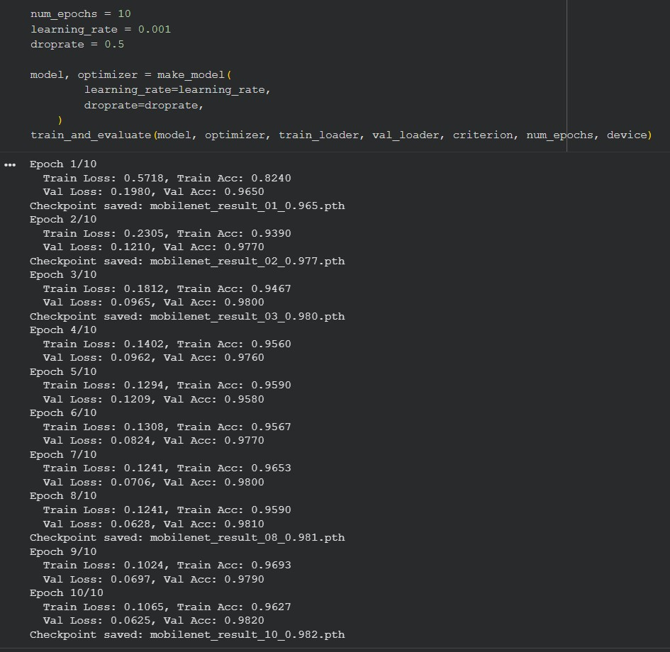

Tuning (adjusting) of the parameters to select the best values:

### Tuning of learning_rate parameter:

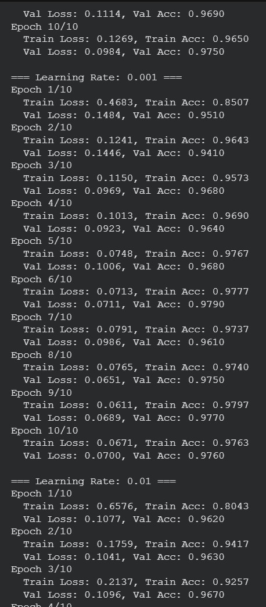

### Tuning of size_inner parameter:

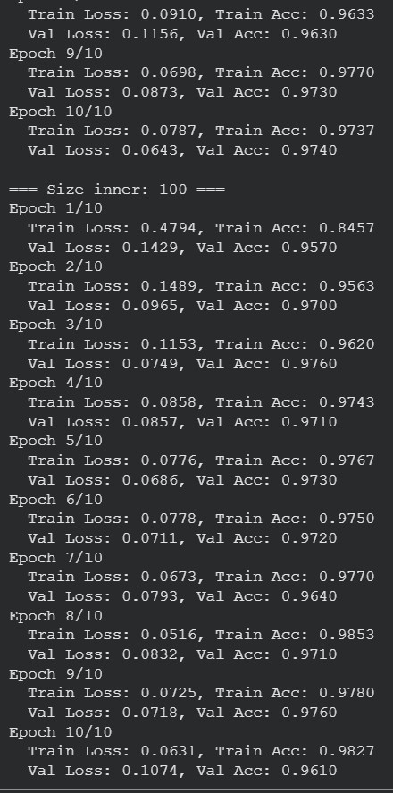

### Tuning of droprate parameter:

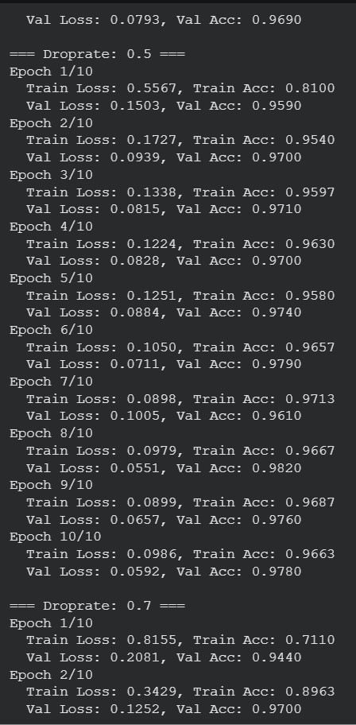

### Tuned parameters with the best values
- learning_rate = 0.001
- size_inner = 100
- droprate = 0.5

### Final model training with the best parameters:

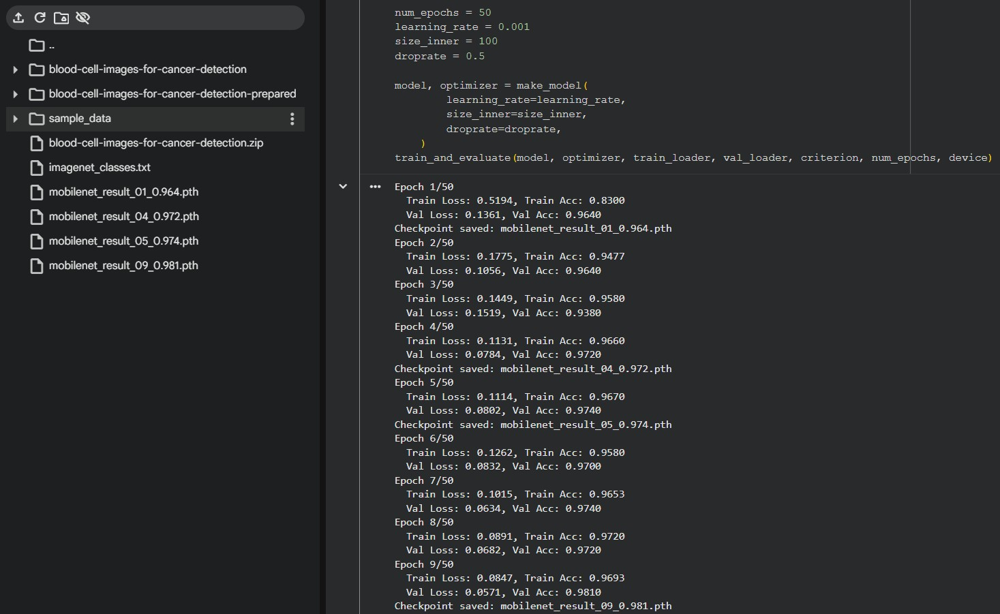

Validation accuracy for the trained model reached with tuning of parameters and augmentation is more than **98 percents** as demonstrated on the screenshot above.

### Testing of the model by the image from test part of dataset (single testing):

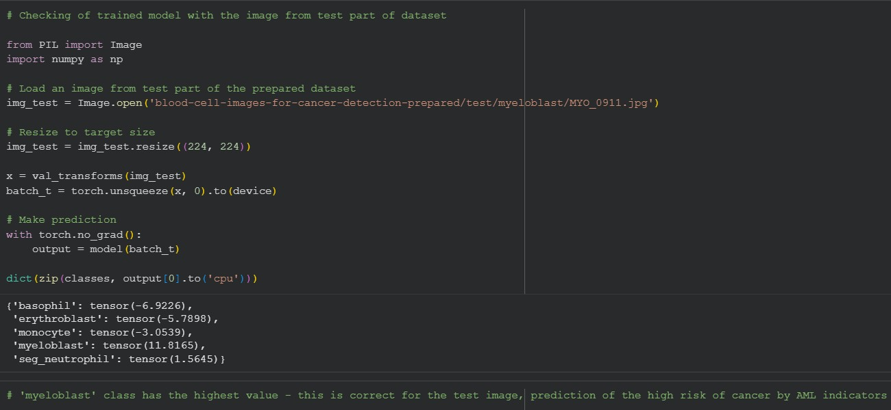

## Reproducibility

Google Colab was used to train the model and tune the parameters. Script was up and running several times like it was presented on screenshots above so notebook is quite stable and working really well without any errors and exceptions.

### Dataset usage

Dataset is free and accessible via Kaggle:

```bash
!curl -L -o blood-cell-images-for-cancer-detection.zip\
  https://www.kaggle.com/api/v1/datasets/download/sumithsingh/blood-cell-images-for-cancer-detection

!unzip blood-cell-images-for-cancer-detection.zip -d "blood-cell-images-for-cancer-detection"
```


## Model deployment

### The resulting model had PyTorch format so was converted to universal ONNX format for convenience and easy deployment:
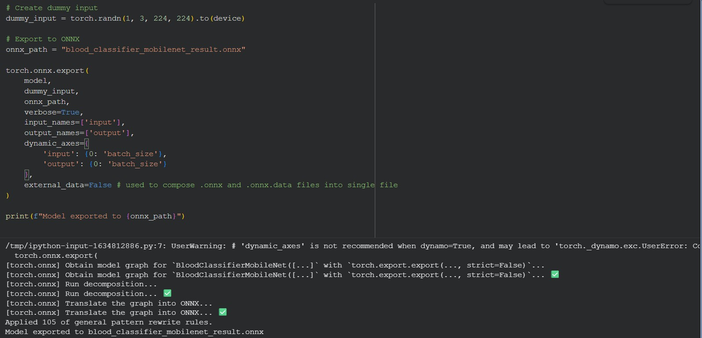

Model is deployed with modern and powerful FastAPI framework since it's used and demonstrated into app.py script: [app.py](https://github.com/shall-it/machine-learning-zoomcamp/blob/main/capstone-project/app.py)


## Dependency and environment management

All environment dependencies with specific versions are collected and described by three important files from project root point:
- [.python-version](https://github.com/shall-it/machine-learning-zoomcamp/blob/main/capstone-project/.python-version)
- [pyproject.toml](https://github.com/shall-it/machine-learning-zoomcamp/blob/main/capstone-project/pyproject.toml)
- [uv.lock](https://github.com/shall-it/machine-learning-zoomcamp/blob/main/capstone-project/uv.lock)

Please ensure uv is installed first:
```bash
pip install uv
```
UV is pretty fast Python package manager and tool of the workflow process written in Rust.

Setup dedicated environment, then install and align all the dependencies with the required versions via uv command:
```bash
uv sync --locked
```
In case of Dockerization .python-version, pyproject.toml and uv.lock should be copied into working directory of appliation Docker image.
Then uv sync --locked command should be executed to setup of environment and install all the dependencies with the specific versions.

## Containerization

Check Docker service is up and running first:
In case of Ubuntu WSL
```bash
sudo service docker status
```
or
```bash
sudo systemctl status docker
```

For building of Docker image use: [Dockerfile](https://github.com/shall-it/machine-learning-zoomcamp/blob/main/capstone-project/Dockerfile)

Build the Docker image by command from the root point of project directory:
```bash
docker build -t cancer-predictor .
```

Check the Docker image is successfully builded:
```bash
docker images
```
The output should look like:

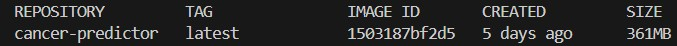

Start Docker container to test application functionality:
```bash
docker run -it --rm -p 8080:8080 cancer-predictor
```
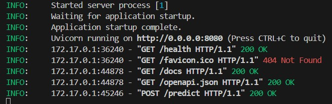

Use this link from any browser locally to check health status of application:
```bash
http://localhost:8080/health
```
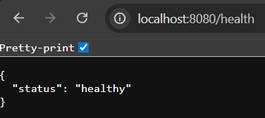

Use this link from any browser locally to enter to the Swagger UI. Swagger UI is a tool which allows to demonstrate possible API calls with their types:
```bash
http://localhost:8080/docs
```
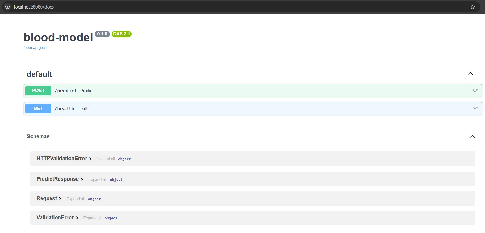

Swagger UI also allows to execute the required POST request with the example URL of test image:
```bash
http://localhost:8080/predict
```
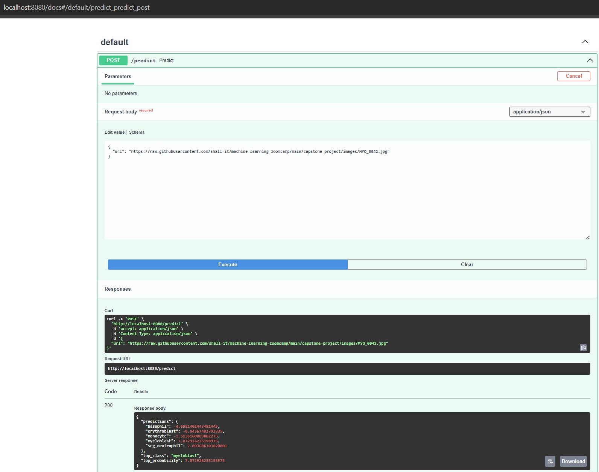


## Kubernetes/Cloud deployment

### Environment setup for local Kubernetes deployment

**Install kubectl**
```bash
cd 

mkdir bin && cd bin

curl -LO "https://dl.k8s.io/release/$(curl -L -s https://dl.k8s.io/release/stable.txt)/bin/linux/amd64/kubectl"
chmod +x kubectl

cd

export PATH="${PATH}:${HOME}/bin"

which kubectl

kubectl version --client
```
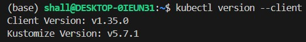

**Install kind**
```bash
curl -Lo ${HOME}/bin/kind https://kind.sigs.k8s.io/dl/v0.20.0/kind-linux-amd64
chmod +x ${HOME}/bin/kind

kind version
```
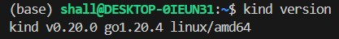

### Create a local Kubernetes cluster
```bash
kind create cluster --name capstone

kubectl cluster-info
kubectl get nodes
```
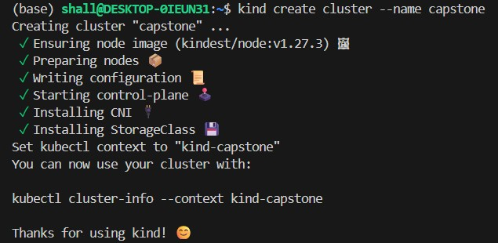

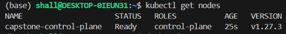

### Loading Docker image to Kind
```bash
kind load docker-image cancer-predictor:latest --name capstone
```
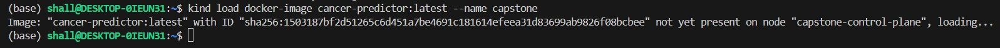

### Move to the root point of Capstone project directory

### Applying of deployment
```bash
kubectl apply -f k8s/deployment.yaml

kubectl get deployments
```
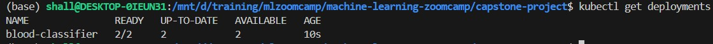

### Applying of service
```bash
kubectl apply -f k8s/service.yaml

kubectl get services
```
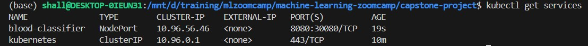

### Using of port forwarding
```bash
kubectl port-forward service/blood-classifier 30080:8080
```

### Basic testing
```bash
curl http://localhost:30080/health
```


In case of checking from /predict (initially from /docs) cancer prediction works correctly:
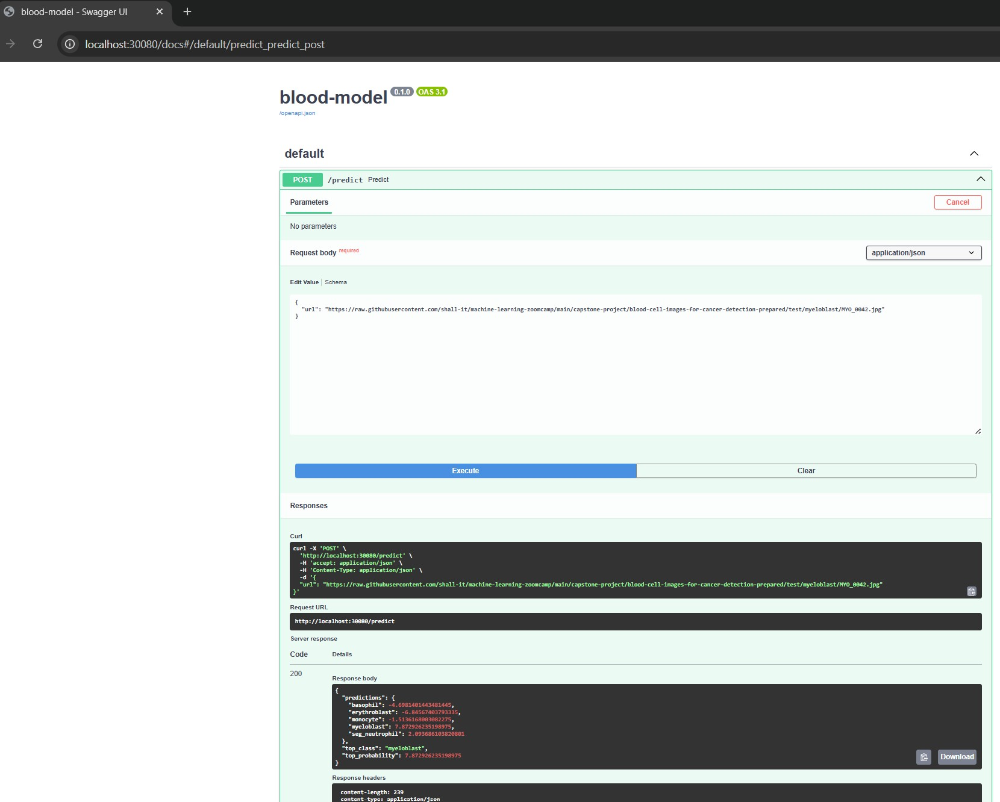

### Final testing of application with the test.py script

[test.py](https://github.com/shall-it/machine-learning-zoomcamp/blob/main/capstone-project/test.py)


### HPA and loading testing (optional)
- [load_test.py](https://github.com/shall-it/machine-learning-zoomcamp/blob/main/capstone-project/load_test.py)
- [hpa.yaml](https://github.com/shall-it/machine-learning-zoomcamp/blob/main/capstone-project/k8s/hpa.yaml)

These files can be used like optional testing of high loading of application and demonstrating of work of Horizontal Pod Autoscaler